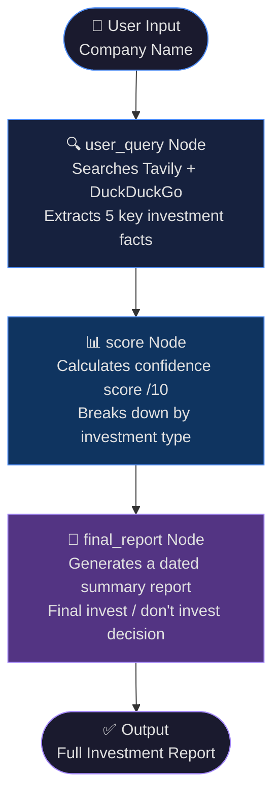

# 🤖 AI Investment Research Agent

An agentic financial research tool that takes any company name and gives you a full investment analysis — facts, confidence scores, and a final recommendation — all powered by LangGraph and Groq's LLaMA 3.1.

I built this to explore how LLM agents can automate research workflows that would otherwise take hours to do manually. The agent searches the web in real time, reasons over the results, and generates a structured report with an actual invest/don't invest decision.

---

## 🧠 How It Works

The agent runs through a **3-node LangGraph pipeline**:



**Node breakdown:**

- **`user_query`** — LLM with bound tools (Tavily + DuckDuckGo) searches the web and pulls 5 investment-relevant facts about the company
- **`score`** — Takes those facts and computes a confidence score out of 10, broken down by investment type (equity, bonds, etc.)
- **`final_report`** — Combines facts + scores into a clean dated report with a clear final decision

---

## ✨ Features

- 🔎 **Dual search** — Tavily for structured results + DuckDuckGo as fallback
- ⚡ **Fast inference** — Groq's LLaMA 3.1 8B for low-latency responses
- 📋 **Structured output** — Facts → Score → Final report, every time
- 📅 **Auto-dated reports** — Report always includes today's date
- 🖥️ **Streamlit UI** — Clean frontend to enter a company and read the report
- 🔌 **FastAPI backend** — Decoupled API if you want to integrate it elsewhere

---

## 🛠️ Tech Stack

| Layer | Tools |
|---|---|
| Agent Framework | LangGraph, LangChain |
| LLM | Groq — `llama-3.1-8b-instant` |
| Search Tools | Tavily, DuckDuckGo |
| Backend | FastAPI, Uvicorn |
| Frontend | Streamlit |
| State Management | LangGraph `TypedDict` StateGraph |

---

## 📁 Project Structure

```
AI-Investment-Research-Agent/
│
├── main.py               # LangGraph agent — nodes, edges, graph compile
├── research.py           # Core research logic and state definitions
├── app.py                # Streamlit frontend
├── requirements.txt      # Dependencies
└── researchagent.ipynb   # Notebook — where I built and tested this
```

---

## 🚀 Getting Started

**1. Clone the repo**
```bash
git clone https://github.com/sonikadeshwal/AI-Investement-Reserach-Agent.git
cd AI-Investement-Reserach-Agent
```

**2. Install dependencies**
```bash
pip install -r requirements.txt
```

**3. Set up environment variables**

Create a `.env` file:
```env
GROQ_API_KEY=your_groq_api_key
TAVILY_API_KEY=your_tavily_api_key
```

Get your keys:
- Groq → [console.groq.com](https://console.groq.com)
- Tavily → [tavily.com](https://tavily.com)

**4. Run the app**
```bash
streamlit run app.py
```

Or if you want just the backend:
```bash
uvicorn main:app --reload
```

---

## 💡 Example

Enter a company name like **"NVIDIA"** and the agent will:

1. Search for recent investment-relevant news and data
2. Return 5 bullet points summarizing the case for/against investing
3. Score each investment type out of 10
4. Generate a final report with a clear recommendation

---

## 📌 What I Learned

- How to wire up multi-node agent pipelines using LangGraph's `StateGraph`
- How to bind tools to an LLM and let it decide when to search
- Separating concerns between research, scoring, and reporting — keeping each node single-responsibility
- FastAPI + Streamlit as a clean decoupled architecture for agentic apps

---

## 🔗 Connect

**Sonika Deshwal**
[LinkedIn](https://linkedin.com/in/sonikadeshwal) · [Portfolio](https://sonikadeshwal.netlify.app) · [GitHub](https://github.com/sonikadeshwal)
